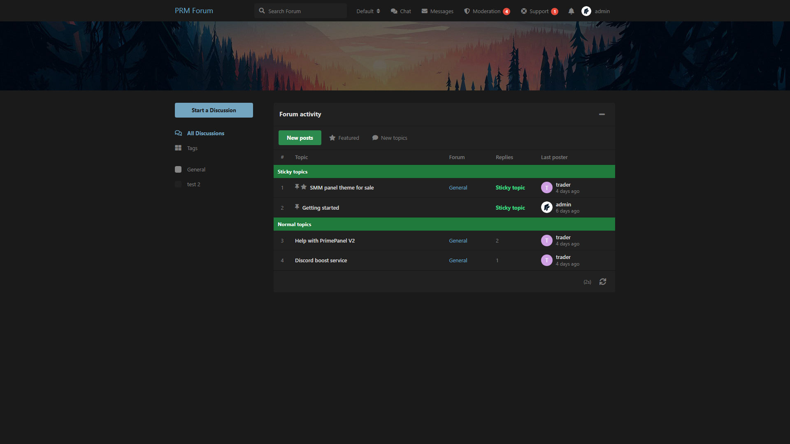

# Forum Activity

XenForo-style activity list on the homepage: sticky topics, latest posts, featured threads.

Compatible with **Flarum 1.8**.

## Screenshot



## What it does

- Replaces the default discussion list with a **forum activity** table
- Tabs: **New posts**, **Featured**, **New topics**
- Sticky topics stay in their own section
- Staff can **feature** / unfeature a discussion from its controls
- Works with Flarum Tags (forum column uses the discussion’s tag)

## Install

```bash
composer config repositories.prm-forum-activity vcs https://github.com/smmpanelscripts1/prm-forum-activity
composer require prm/forum-activity:dev-main
```

Enable **Forum Activity**, then:

```bash
php flarum migrate
php flarum cache:clear
```

## How to use

1. Admin → Permissions → enable **Feature discussions** for staff
2. On a discussion, use **Feature** / **Unfeature**
3. Homepage tabs switch between latest posts, featured, and newest topics

Pairs well with **Sleek Dark XF** and **Hero Image**.

## License

MIT
